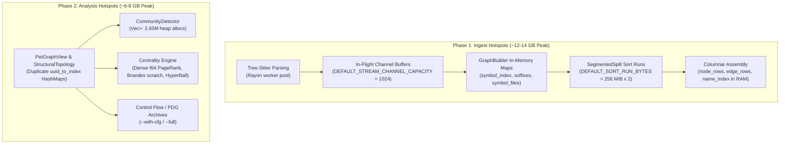
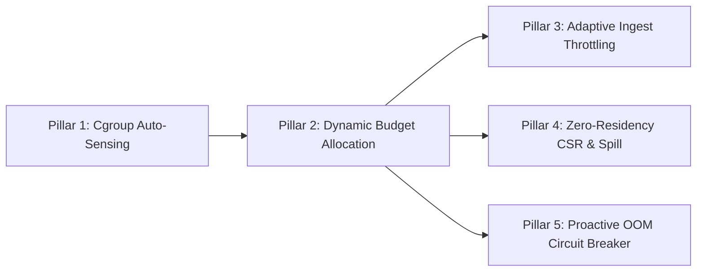

# Containerized Memory Management & RSS Threshold Enforcement for `rgctl`

## Executive Summary

When running `rgctl` on massive codebases (e.g., the Linux kernel with ~71k files, 2.65M nodes, and 1.86M functions), peak Resident Set Size (RSS) currently reaches **12.7 GB to 14.7 GB**. 

In containerized environments (Kubernetes pods, Docker containers, AWS ECS / Fargate, CI/CD runners), memory limits are strictly enforced by the Linux kernel using cgroups. If a process exceeds its assigned memory ceiling, the Linux kernel **immediately terminates it via the Out-Of-Memory (OOM) killer** with exit code `137` (`SIGKILL`).

This report details:
1. **Anatomy of Memory Consumption**: Where the 12–15 GB is spent during Ingest, Spill, and Analysis.
2. **Container-Specific Failure Modes**: Why standard container environments amplify memory usage (e.g., thread explosion from host core detection).
3. **Immediate Operational Mitigations**: How to configure `rgctl` today to stay within reasonable boundaries.
4. **Architectural Roadmap**: A 5-pillar blueprint to introduce hard and soft memory caps, adaptive streaming, streaming columnar assembly, and graceful degradation.

---

## 1. Anatomy of Memory Hotspots in `rgctl`

Memory consumption in `rgctl` occurs in two distinct, non-overlapping macro phases: **Ingest (Discover & Spill)** and **Analysis (Topology & Graph Metrics)**.



### 1.1 Ingest Phase Hotspots

| Component | Source Location | Mechanism | Impact on Large Repos (Linux Kernel) |
|---|---|---|---|
| **In-Flight Queue** | `crates/rgctl-pipeline/src/stream.rs:16` | `DEFAULT_STREAM_CHANNEL_CAPACITY = 1024` buffers `FileExtraction` payloads between worker threads and merge. | Up to 1,024 parsed AST results with symbol/relation vectors held in RAM concurrently. |
| **Pass-1 Name Maps** | `crates/rgctl-extraction/src/graph_builder.rs:28-69` | `HashMap<String, Uuid>` and `HashMap<String, Vec<Uuid>>` for `symbol_index`, `symbols_by_qualified`, `symbols_by_suffix`, and `symbol_files`. | 2.65M heap strings + hash table bucket overhead = **several gigabytes** of heap allocations. |
| **Spill External Sort** | `crates/rgctl-graph/src/segmented_spill.rs:29` | `DEFAULT_SORT_RUN_BYTES = 256 * 1024 * 1024`. Sort runs for nodes and edges execute concurrently in Rayon. | 2 × 256 MiB raw record buffers + deserialized records + I/O buffers = **~1.0 to 1.5 GB**. |
| **Columnar Assembly** | `crates/rgctl-graph/src/segmented_spill.rs:265-332` | `write_columnar_from_spill` loads all sorted nodes and edges into `node_rows`, `edge_rows`, `name_index`, `type_index`, and `StringPool`. | Entire node and edge index table materialized in memory simultaneously prior to serialization. |

### 1.2 Analysis Phase Hotspots

| Component | Source Location | Mechanism | Impact on Large Repos (Linux Kernel) |
|---|---|---|---|
| **Dual Topology Maps** | `crates/rgctl-analysis/src/graph_utils.rs:68-80` | `PetGraphView::from_topo` clones `index_to_uuid` and rebuilds a duplicate `uuid_to_index` map over `StructuralTopology`. | Two full 2.65M-entry `HashMap<Uuid, NodeIndex>` structures in memory. |
| **Community Adjacency** | `crates/rgctl-analysis/src/community.rs:200-260` | Community detection uses `neighbors: Vec<Vec<usize>>` instead of flat CSR slices. | **2.65 million individual heap allocations**, leading to allocator metadata fragmentation. |
| **Centrality Calculations** | `crates/rgctl-analysis/src/centrality.rs` | Dense `Vec<f64>` arrays for PageRank, Brandes scratchpads for sampled betweenness. | Hundreds of MBs in dense arrays; exact harmonic BFS / HyperBall takes multi-GB if enabled. |

---

## 2. The Containerization Trap: Why Containers OOM Faster

When running inside Docker or Kubernetes, two specific system interactions cause memory consumption to spike even higher than on bare-metal machines:

```
HOST MACHINE (e.g., 64-128 Physical/Logical Cores, 256 GB RAM)
┌────────────────────────────────────────────────────────────────────────┐
│ Kubernetes Pod / Container (CPU Limit: 2 Cores, Memory Limit: 4 GB)    │
│                                                                        │
│   ❌ CPU Detection Trap:                                               │
│      std::thread::available_parallelism() returns 128 (Host cores)!   │
│      Rayon spawns 128 worker threads inside a 2-core container.        │
│                                                                        │
│   ❌ Memory Amplification:                                             │
│      128 threads x (Tree-Sitter scratch + stack + in-flight queue)     │
│      Process allocates 6-8 GB in seconds -> Exceeds 4 GB limit.        │
│                                                                        │
│   💥 Linux Kernel OOM Killer:                                          │
│      cgroup memory.max exceeded -> SIGKILL (Exit code 137).            │
└────────────────────────────────────────────────────────────────────────┘
```

1. **Host CPU Count vs CFS Quotas**:
   - `rayon::ThreadPoolBuilder` and standard Rust concurrency libraries read `/sys/devices/system/cpu` or `sched_getaffinity`. On a 64- or 128-core host node, Rayon will spawn 64 to 128 threads even if the pod is limited to `resources.limits.cpu: 2`.
   - 128 active workers parsing files concurrently will saturate the 1024-element channel buffer with large files, triggering massive allocation spikes.
2. **Missing Cgroup Memory Awareness**:
   - Currently, `rgctl` does not inspect `/sys/fs/cgroup/memory.max` (cgroups v2) or `/sys/fs/cgroup/memory/memory.limit_in_bytes` (cgroups v1).
   - The tool proceeds with desktop/server assumptions (`DEFAULT_SORT_RUN_BYTES = 256 MiB`, unconstrained queues).

---

## 3. Operational Playbook: Immediate Mitigations for Containers

If running `rgctl` in containerized CI/CD or production environments today, use the following operational flags and environment variables to constrain memory:

### 3.1 Docker / Kubernetes Recommended Configuration

```bash
# 1. Cap Rayon worker threads to match container CPU limits (Crucial!)
export RAYON_NUM_THREADS=4

# 2. Avoid deep passes on massive corpora inside small containers
# DO NOT pass --with-harmonic or --full on Linux-scale repos
rgctl discover . -v \
  --repo /workspace \
  -l c  # Filter to target language if applicable
```

### 3.2 Feature Profile vs Memory Footprint

| Command / Flag | Target Corpus | Peak RSS | Minimum Container RAM |
|---|---|---|---|
| `rgctl discover .` (Default) | Linux kernel (~71k files) | **~12.7 GB** | **16 GB** (or 14 GB + swap) |
| `rgctl discover .` (Default) | Medium Repo (~10k files, Roslyn/VS Code) | **~1.5 – 3.9 GB** | **4 GB – 6 GB** |
| `rgctl discover .` (Default) | Standard Repo (<2k files) | **~300 – 800 MB** | **1 GB – 2 GB** |
| `rgctl discover . --full` | Medium Repo (metasfresh) | **~6.4 GB** | **8 GB** |
| `rgctl discover . --with-harmonic` | Any large repo (>500k nodes) | **+3 – 5 GB** | **+6 GB** overhead |

> [!WARNING]
> Never use `--with-harmonic` or `--full` in containers with less than 16 GB of memory on kernel-scale repositories.

---

## 4. Architectural Solution: 5-Pillar Memory Guard Design

To make `rgctl` bulletproof inside containerized environments with strict thresholds (e.g., 2 GB, 4 GB, or 8 GB), we recommend implementing the following 5-pillar design.



### Pillar 1: Cgroup & Container Environment Sensing
Automatically detect container constraints at startup:
- Read cgroups v2 (`/sys/fs/cgroup/memory.max` and `/sys/fs/cgroup/cpu.max`) or cgroups v1 (`memory.limit_in_bytes` and `cpu.cfs_quota_us / cpu.cfs_period_us`).
- Provide an explicit CLI flag `--memory-limit <MB>` and environment variable `RGCTL_MEMORY_LIMIT_MB`.
- Auto-calculate:
  $$\text{Effective Budget} = \min(\text{CLI Flag}, \text{Cgroup Limit} \times 0.85, \text{Host Free RAM} \times 0.85)$$

### Pillar 2: Dynamic Budget Allocation
Partition the memory budget across pipeline phases:

```text
Total Container Budget: 4,096 MB (4 GB)
├── Operating Headroom (15%):     614 MB (Kernel buffers, binary, thread stacks)
├── Phase 1 (Ingest Budget):    3,482 MB
│   ├── Rayon Worker Buffers:     512 MB (Workers × parser scratch)
│   ├── In-Flight Stream Channel: 256 MB (Dynamically scaled queue)
│   ├── GraphBuilder HashMaps:  2,000 MB (String pool & lookup tables)
│   └── External Sort Runs:       714 MB (Run buffers scaled down to 64 MB)
└── Phase 2 (Analysis Budget):  3,482 MB (Ingest freed, mmap opened)
    ├── PetGraphView CSR:         500 MB (Single CSR topology)
    ├── Analysis Results Columns: 1,200 MB (Flat f32/u32 arrays)
    └── Working Scratch:        1,782 MB (Community & centrality buffers)
```

### Pillar 3: Adaptive Ingest & Streaming Throttling
1. **Thread Pool Clamping**:
   Clamp `thread_count` to $\min(\text{cgroup\_quota}, \text{threads})$.
2. **Channel Capacity Adaptation**:
   Instead of a static `DEFAULT_STREAM_CHANNEL_CAPACITY = 1024`, scale dynamically:
   $$\text{Capacity} = \text{clamp}\left(\frac{\text{Budget MB}}{10}, 32, 1024\right)$$
   In a 2 GB container, capacity drops to 128 items, preventing worker extraction from outpacing the merge thread and ballooning heap memory.
3. **Sort Run Scaling**:
   Scale `DEFAULT_SORT_RUN_BYTES` down from 256 MiB to 32 MiB or 64 MiB when budget is $\le 4\text{ GB}$. External merge-sort will take a few more I/O passes, but peak RSS will drop by hundreds of megabytes.

### Pillar 4: Ingest & Analysis Compaction
1. **String Interning for Symbol Maps**:
   Replace full `String` keys in `GraphBuilder` (`symbol_index`, `symbols_by_suffix`, `symbols_by_qualified`) with `CompactString` (inline up to 24 bytes) or an arena-backed `StringPool` integer index (`SymbolId`).
2. **Flatten Community Detection (`Vec<Vec<usize>>` $\to$ CSR)**:
   In `crates/rgctl-analysis/src/community.rs`, replace `Vec<Vec<usize>>` with flat CSR index slices:
   ```rust
   pub struct FlatAdjacency {
       pub offsets: Vec<usize>,     // node_count + 1
       pub targets: Vec<usize>,     // edge_count
   }
   ```
   Eliminates 2.65 million small heap allocations, reducing allocator overhead and fragmentation by over 1 GB on Linux-scale graphs.
3. **Deduplicate `uuid_to_index`**:
   Remove the redundant `uuid_to_index` map in `PetGraphView`, borrowing directly from `StructuralTopology`.

### Pillar 5: Proactive OOM Circuit Breaker (Soft-Landing)
A process killed by `SIGKILL` (137) produces zero artifacts and leaves a corrupt cache. Instead, `rgctl` should feature an active soft-landing monitor:

1. **Background High-Frequency Monitor**:
   The existing `MemoryMonitor` in `rgctl-core` samples every 50ms.
2. **Tripwire at 90% Budget**:
   - If RSS exceeds $0.90 \times \text{Budget}$:
     1. **Pause Workers**: Signal the extraction channel to pause worker file reading.
     2. **Spill Flush**: Force `GraphBuilder` to immediately flush in-memory structures to disk spill.
     3. **Stage Shedding**: If memory remains critical during analysis, skip secondary metrics (e.g. skip betweenness and circular dependency detection, keep PageRank and basic topology).
     4. **Safe Exit**: If memory reaches 95%, write a consistent partial snapshot to `.rgctl/` and exit with an informative error message:
        ```text
        [ERROR] Memory limit of 4096 MB approached (current RSS: 3892 MB).
        Discovery gracefully aborted to prevent container OOMKill.
        Partial graph snapshot saved. Increase container memory or filter by language (-l).
        ```

---

## 5. Implementation Summary & Recommendations

| Priority | Action Item | Target Crate | Complexity | Expected RSS Reduction |
|---|---|---|---|---|
| **P0 (Immediate)** | Add `--memory-limit-mb` CLI & cgroup limit detection | `rgctl`, `rgctl-core` | Low | Prevents OOM kills via auto-scaling |
| **P0 (Immediate)** | Clamp Rayon worker pool to cgroup CPU quota | `rgctl-pipeline` | Low | Cuts multi-GB spikes on large host nodes |
| **P1 (Near-term)** | Dynamic `stream_channel_capacity` and `SORT_RUN_BYTES` | `rgctl-pipeline`, `rgctl-graph` | Medium | Saves 500 MB – 1.5 GB in ingest |
| **P1 (Near-term)** | Flatten `CommunityDetector` adjacency from `Vec<Vec<usize>>` to CSR | `rgctl-analysis` | Medium | Saves 1.0 – 1.5 GB in analysis |
| **P2 (Long-term)** | Replace `String` keys in `GraphBuilder` with interned IDs | `rgctl-extraction` | High | Saves 2.0 – 3.0 GB on 2M+ node graphs |
| **P2 (Long-term)** | Streaming columnar snapshot assembly directly from spill | `rgctl-graph` | High | Eliminates assembly-time RAM spike |
